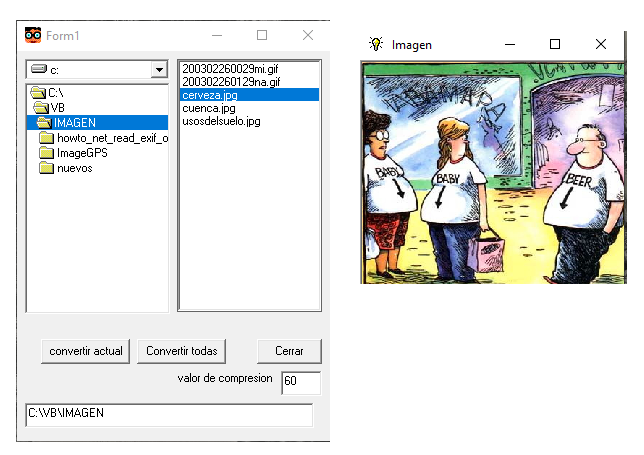

# VB_reduce_imag
Pequeño programa en VB 5 para reducir tamaño imagen. Hecho en el 2004.

## Objetivo
Este programa simple me fue muy util cuando hice una web de artesanía que quería tener una versión pequeña de muchas imágenes.
Simplemente reduce una o todas las imagenes de un directorio al tamaño que le digas de forma gráfica modificando la ventana de imagen.

Las nuevas imagenes las guarda en la carpeta nuevas.

## Vista del progama

